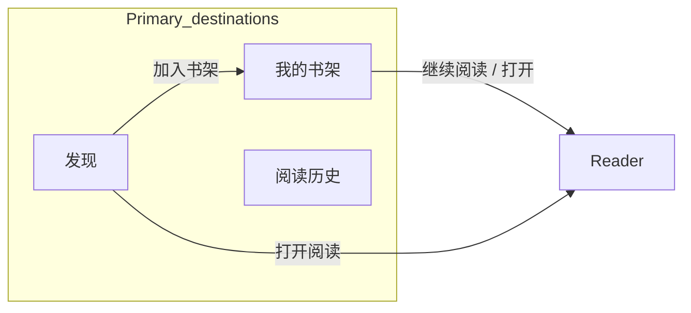

# MVP 1 — Module Roadmap (Anti-Drift)

**Purpose:** Module-level inventory for **prototype design** and **MVP 1 delivery**.  
Use this doc to decide _what modules exist_ and _what each is for_. Do **not** invent extra learner modules here.  
Per-module interaction details (controls, empty states, copy variants) are **out of scope** for this file—plan those later against each module.

**Related:** [`mvp-scope.md`](./mvp-scope.md) (capability must/must-not) · [`prototype-flows.md`](./prototype-flows.md) (nav journeys) · [`product-vision.md`](./product-vision.md) · [`roadmap.md`](./roadmap.md) · ADR-001 [`../adr/001-reading-content-domain-model.md`](../adr/001-reading-content-domain-model.md)

**Locked (2026-08-24):** Learner module set = shelf + discover + reading history + Reader; **no user upload in MVP 1**; **admin EPUB pipeline in MVP 1a**.

---

## 0. What this doc locks vs does not lock

| Locked (anti-drift)                                                                        | **Not** locked — redesign freely                                   |
| ------------------------------------------------------------------------------------------ | ------------------------------------------------------------------ |
| Which **modules** exist in MVP 1                                                           | Page **layout** / grid / spacing / type scale                      |
| Each module’s **responsibility** and coarse capabilities                                   | Visual chrome (bottom bar vs sidebar vs top nav **presentation**)  |
| Which destinations are in the learner **IA** (书架 / 发现 / 阅读历史 + Reader via content) | How those destinations are **visually arranged** on screen         |
| Must-not list (**user** upload, Practice, Search page, …)                                  | Current shipped UI structure — expect it to change with prototypes |
| Journeys at module-path level                                                              | Component hierarchy, cards, density, motion                        |

**Existing app layouts are not a spec.** Prototypes may replace them entirely as long as the module set and responsibilities still match this doc. Visual tokens stay in [`DESIGN.md`](../../DESIGN.md) when implementing—not a freeze of today’s feature layouts.

---

## 1. How to use this doc

| Role          | Use                                                                                                                                               |
| ------------- | ------------------------------------------------------------------------------------------------------------------------------------------------- |
| Prototype     | Keep the **module set** in §3–§4; invent **any** layout that serves those responsibilities. No Practice, Review, Search page, or **user** Upload. |
| Product / eng | A feature belongs in MVP 1 only if it sits under a module below. Else defer or refuse.                                                            |
| Review        | New **top-level learner module** → reject unless this doc is updated. New **layout** for an existing module → OK.                                 |

Capability rules (AI identity, no drills, etc.) still come from [`mvp-scope.md`](./mvp-scope.md) and [`feature-decision-guide.md`](./feature-decision-guide.md).

---

## 2. Delivery slices inside Phase 1

Full Phase 1 outcome remains “language reading environment” ([`roadmap.md`](./roadmap.md)). Split so prototypes and builds do not silently pull in import:

| Slice  | Name                       | In MVP 1?                        | Outcome                                                                                      |
| ------ | -------------------------- | -------------------------------- | -------------------------------------------------------------------------------------------- |
| **1a** | Admin EPUB catalog → shelf | **Yes — this document’s target** | Admin EPUB upload → process → publish **ReadingWork**; Discover → shelf → Reader + companion |
| **1b** | User import                | **No — deferred**                | User EPUB/PDF/web import; `用户` source on shelf                                             |

MVP 1 prototypes and MVP 1 engineering **stop at 1a**. Do not require **user** upload to call MVP 1 “done.” Admin EPUB ops **is** in 1a.

---

## 3. Learner information architecture (destinations, not layout)

These are **destinations / modules**, not a prescribed shell layout:

```text
Logged-out:  Landing → Auth → 我的书架
Learner primary destinations (exactly three):
  我的书架  |  发现  |  阅读历史
Content path (not a primary destination in the shell set):
  → Reader
```



How you **render** navigation (tab bar, rail, menu, …) is a layout choice for the prototype.

| Destination (ZH) | English name    | Role (module only)                                    |
| ---------------- | --------------- | ----------------------------------------------------- |
| **我的书架**     | My shelf        | Default home. Continue reading + my shelf items       |
| **发现**         | Discover        | Official catalog; add to shelf; may open reader       |
| **阅读历史**     | Reading history | Reading-history overview (not streak / drill theater) |
| **Reader**       | Reader          | Core read surface; entered via content only           |

**Naming locked:** Prefer **发现** over 图书馆; prefer **阅读历史** over 成长; prefer **我的书架** over 今日 / 我的图书.

---

## 4. MVP 1 modules — responsibility & rough capabilities

Module = a coherent product surface or capability block. Lists below are **coarse** (what belongs here), not UI specs. Interaction details come later per module.

### 4.1 Landing

|                        |                                                                    |
| ---------------------- | ------------------------------------------------------------------ |
| **Responsibility**     | Tell logged-out visitors what Gloaming is and move them into auth. |
| **Rough capabilities** | Brand / story; primary CTA → sign in; optional path to sign up.    |

Not a learning dashboard. No reading chrome.

### 4.2 Auth

|                        |                                                                                        |
| ---------------------- | -------------------------------------------------------------------------------------- |
| **Responsibility**     | Establish a signed-in session so the user can own a shelf and resume.                  |
| **Rough capabilities** | Sign in; sign up; email verification; forgot / reset password; success → **我的书架**. |

Infra for the reading loop, not a product destination.

### 4.3 我的书架 (My shelf)

|                        |                                                                                                                                                                                                                     |
| ---------------------- | ------------------------------------------------------------------------------------------------------------------------------------------------------------------------------------------------------------------- |
| **Responsibility**     | Default home after login: show **what I am reading** and get me back into the book fast.                                                                                                                            |
| **Rough capabilities** | **Continue reading** (last unfinished text); shelf grid of books I added; open a book → Reader; per-item **source label** (`官方` in MVP 1; `用户` reserved for Phase 1b); empty state that points toward **发现**. |

No Tab split (mine vs catalog). No **user** upload on this page in MVP 1. Optional light local filter later—not required.

### 4.4 发现 (Discover)

|                        |                                                                                                                               |
| ---------------------- | ----------------------------------------------------------------------------------------------------------------------------- |
| **Responsibility**     | Let the user **find official texts** and put them on the shelf (novel-reader “bookstore → bookshelf” pattern).                |
| **Rough capabilities** | Browse official catalog; **add to shelf** (primary story); **open to read** (allowed); show enough metadata to choose a text. |

No independent Search page. Filters optional / non-blocking. Does not replace 我的书架 as the daily home.

### 4.5 阅读历史 (Reading history)

|                        |                                                                                                                                                                     |
| ---------------------- | ------------------------------------------------------------------------------------------------------------------------------------------------------------------- |
| **Responsibility**     | Calm overview of **reading over time**—not streaks, XP, or homework queues.                                                                                         |
| **Rough capabilities** | Reading-history style summary (e.g. days active, volume / completions / lookups as the product already trends toward); evolve copy away from “学习 / 成长” framing. |

Must not reintroduce Practice / Review. Must not become the reason to open the app.

### 4.6 Reader — reading surface

|                        |                                                                                                                                              |
| ---------------------- | -------------------------------------------------------------------------------------------------------------------------------------------- |
| **Responsibility**     | Be the **core product**: a calm, book-like place to read authentic English and resume position.                                              |
| **Rough capabilities** | Present **ReadingPart** text (typography / page or scroll); chapter/part navigation; restore **ReadingState** (part + anchor); quiet chrome. |

Entered only via content (shelf or discover)—not a shell tab. Target route: `/read/[workId]`.

### 4.7 Reader — AI companion

|                        |                                                                                                                                                 |
| ---------------------- | ----------------------------------------------------------------------------------------------------------------------------------------------- |
| **Responsibility**     | Unstick the user **on this passage**, then recede.                                                                                              |
| **Rough capabilities** | Selection- or ask-triggered help grounded in the current text; secondary rail / panel; optional thread scoped to this document—not a chat home. |

If AI is off, reading still works.

### 4.8 Reader — Translation

|                        |                                                                                                                    |
| ---------------------- | ------------------------------------------------------------------------------------------------------------------ |
| **Responsibility**     | Give meaning of a sentence / passage when the user asks—without replacing English as the default reading language. |
| **Rough capabilities** | Translate selection or passage; bilingual view as an option, not the default layout.                               |

### 4.9 Reader — TTS

|                        |                                                                                                |
| ---------------------- | ---------------------------------------------------------------------------------------------- |
| **Responsibility**     | Let the user **listen** to the current text when that helps them keep going.                   |
| **Rough capabilities** | Play current text audio when ready; degrade gracefully if playback is temporarily unavailable. |

**Ops note (not learner UI):** Auto workflow/TTS steps stay off by default. Before **publish**, every part with synthesizable text must have **ready default US** (`audio_us`) matching the current part hash; UK is optional. Operators generate audio via admin actions + worker queue.

### 4.10 Admin Work Management (catalog ops — supporting)

|                        |                                                                                                                                                                         |
| ---------------------- | ----------------------------------------------------------------------------------------------------------------------------------------------------------------------- |
| **Responsibility**     | Keep the official **ReadingWork** catalog that feeds **发现** publishable and maintainable.                                                                             |
| **Rough capabilities** | Upload EPUB → parse → metadata → generate default US audio (worker) → publish (or unpublish) official works; optional **`admin_text`** for internal dev/test seed only. |

Ops tool—not the learner product identity. Not in learner shell nav. **`admin_text` is not a product capability** — see [`content-strategy.md`](./content-strategy.md) §2.1.

### 4.11 Session / account chrome (supporting)

|                        |                                                                  |
| ---------------------- | ---------------------------------------------------------------- |
| **Responsibility**     | Minimal account affordances already in the app shell.            |
| **Rough capabilities** | Sign out; basic identity display / entry points already present. |

No standalone “Settings product” module in MVP 1.

---

## 5. Explicitly out of MVP 1

Do not add these as modules or prototype screens for MVP 1:

| Out                                               | Why                                    |
| ------------------------------------------------- | -------------------------------------- |
| **User** upload / import / global upload entry    | Slice **1b**                           |
| Short Article Library / paste CMS as product      | Superseded — ADR-001 ReadingWork       |
| Independent Search page                           | Not needed; shelf volume stays small   |
| Shelf Tabs (“mine” vs “catalog”)                  | Use **source labels** on items instead |
| Practice / Review / SRS / quiz                    | Removed; identity conflict             |
| Chat as home / free-topic AI home                 | Companion stays inside Reader          |
| Social feed, speaking, avatars, gamification / XP | [`mvp-scope.md`](./mvp-scope.md) §3    |
| Kitchen-sink study control panels                 | Vision anti-patterns                   |

---

## 6. Journeys (module path only)

### First-time (1a)

```text
Auth → 我的书架 (empty or few items)
  → 发现 → 加入书架
  → 我的书架 → open → Reader
  → (optional) AI / translate / TTS
  → keep reading
```

### Daily (1a)

```text
Open → 我的书架 → Continue reading → Reader
  → help when stuck → leave
```

Alternate: **发现** → open or add → Reader / shelf.

---

## 7. Prototype checklist

Before a prototype is accepted for MVP 1:

- [ ] Learner **destinations** are exactly: 我的书架 / 发现 / 阅读历史 (layout of that nav is free)
- [ ] Reader is reachable only via content (not a fourth primary destination)
- [ ] No **user** upload control required in learner chrome
- [ ] No Practice / Review / Search **module**
- [ ] Discover primary story is **add to shelf** (open-to-read allowed)
- [ ] Shelf includes source-label concept (`官方`; `用户` not required until 1b)
- [ ] Continue reading belongs to **我的书架** (placement on the page is free)
- [ ] Layout may differ entirely from the current shipped app

---

## 8. Change log

| Date       | Change                                                                                                 |
| ---------- | ------------------------------------------------------------------------------------------------------ |
| 2026-08-24 | §4.10 Admin Work Management (EPUB upload); 1a includes admin pipeline; user upload still 1b; ADR-001.  |
| 2026-08-20 | Clarified: modules/IA locked; **layouts not locked** (§0).                                             |
| 2026-08-20 | Added per-module responsibility + rough capabilities (§4).                                             |
| 2026-08-20 | Initial MVP 1 module roadmap: 1a catalog-to-shelf; 1b import deferred; nav 我的书架 / 发现 / 阅读历史. |
| (revision) | §4.9–§4.10: publish default-US gate; auto workflow/TTS flags remain off.                               |
