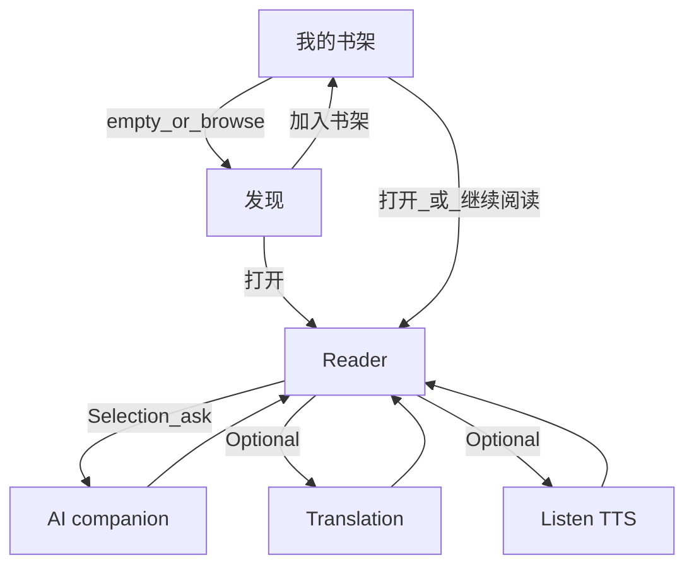

# Product flows

**SSOT for “which screen leads where.”** Wire the shipped app against the tables below. Visual tokens: [`DESIGN.md`](../../DESIGN.md).

Related: [`mvp-scope.md`](./mvp-scope.md) · [`mvp-1-modules.md`](./mvp-1-modules.md) · [`engineering-vocabulary.md`](./engineering-vocabulary.md) · ADR-001 [`../adr/001-reading-content-domain-model.md`](../adr/001-reading-content-domain-model.md)

**How to use**

- Wire the app against the tables below.
- **Module inventory SSOT for MVP 1:** [`mvp-1-modules.md`](./mvp-1-modules.md).
- **Confirmed** = product decisions (auth 2026-08-05; reading loop 2026-08-20; learner IA 2026-08-20; ReadingWork domain 2026-08-24).
- Do not revive Practice or Review screens. Do not add **user** upload to MVP 1 learner flows (Phase 1b).

**Routes (Phase 3A):** `/read/[workId]`, `/discover/[workId]` (detail).

---

## 1. Surfaces (MVP 1 / Phase 1a)

| Surface (label) | Audience   | Role now                                        |
| --------------- | ---------- | ----------------------------------------------- |
| Landing         | Logged-out | Story / CTA into auth                           |
| Sign in / up    | Logged-out | Auth                                            |
| **我的书架**    | Logged-in  | Default home: continue reading + my shelf       |
| **发现**        | Logged-in  | Official **ReadingWork** catalog; add to shelf  |
| **阅读历史**    | Logged-in  | Reading-history overview                        |
| Reader          | Logged-in  | Read **ReadingPart** + assist / translate / TTS |

Practice and Review surfaces are **removed**. **User** upload / import is **out of MVP 1** (Phase 1b). Admin EPUB upload is **ops-only**, not in learner nav.

---

## 2. Auth & marketing flow

Unchanged in structure. Landing primary CTA → Sign in. Sign-up → verify email → auto sign-in → **home**. Reset password → auto sign-in → **home**.

| From                   | To                          | Status                                  |
| ---------------------- | --------------------------- | --------------------------------------- |
| Landing primary CTA    | Sign in                     | **Confirmed**                           |
| Sign in success        | Home (reading)              | **Confirmed** (was Dashboard)           |
| Sign-up                | Check email → verify → Home | **Confirmed** (hard email verification) |
| Reset password success | Home                        | **Confirmed**                           |

---

## 3. First-time user journey (MVP 1 / Phase 1a)

```text
Sign in
  → 我的书架
  → 发现 → 加入书架 (creates ReadingState) or open
  → Reader (ReadingWork / current ReadingPart)
  → Read
  → Language barrier → contextual help / translation / TTS
  → Keep reading
```



**Confirmed (2026-08-20):** first success is **read a real page with help available**, not finish a practice set. Daily first action is **resume the unfinished ReadingWork** on **我的书架**.

**Confirmed (2026-08-24):** MVP 1 catalog supply = **admin-published ReadingWorks** (EPUB pipeline). **User** upload is Phase **1b**.

---

## 4. Daily reading loop (MVP 1)

```text
Open Gloaming
  → 我的书架 → Resume last ReadingWork (ReadingState)
  → Reader → current ReadingPart
  → AI help when stuck
  → Keep reading
  → Leave
```

| From     | Entry                             | To                | Status                |
| -------- | --------------------------------- | ----------------- | --------------------- |
| 我的书架 | Continue / last position          | Reader            | **Confirmed**         |
| 我的书架 | Browse                            | 发现              | **Confirmed**         |
| 发现     | Add to shelf                      | 我的书架          | **Confirmed**         |
| 发现     | Open item                         | Reader            | **Confirmed**         |
| 我的书架 | Open shelf item                   | Reader            | **Confirmed**         |
| Reader   | Lookup / translate / TTS / assist | Stay in reader    | **Confirmed**         |
| Reader   | Done for now                      | 我的书架 or close | **Confirmed**         |
| Reader   | Practice CTA                      | —                 | **Retired** (removed) |
| Any      | 复习                              | —                 | **Retired** (removed) |
| Any      | **User** upload (MVP 1)           | —                 | **Deferred** (1b)     |

**Shell (Confirmed):** default nav is **我的书架 + 发现 + 阅读历史**. Reader is reached via content only.

---

## 5. Happy path (MVP 1 session)

```text
Sign in → 我的书架
  → resume or 发现 → add / open ReadingWork
  → Reader (ReadingPart + optional listen + on-demand help)
  → leave
```

Auth without this loop is **infra**, not product MVP 1.

---

## 6. Cross-cutting rules

| Rule                                                   | Source                                   |
| ------------------------------------------------------ | ---------------------------------------- |
| After auth, land on 我的书架                           | MVP 1 modules                            |
| AI / lookup secondary inside the reader; not chat-home | vision + principles                      |
| No required practice or review                         | V1 non-goals                             |
| 阅读历史 is reading history, not streak theater        | guardrails + feature-audit               |
| No **user** upload in MVP 1 learner chrome             | mvp-1-modules Phase 1a                   |
| Content = ReadingWork + ReadingPart (ADR-001)          | engineering-vocabulary                   |
| Module inventory SSOT                                  | [`mvp-1-modules.md`](./mvp-1-modules.md) |

---

## 7. Confirmed decisions

| #   | Decision                                                | When       |
| --- | ------------------------------------------------------- | ---------- |
| 1   | Landing primary CTA → Sign in                           | 2026-08-05 |
| 2   | Sign-up → verify → reading home                         | 2026-08-05 |
| 3   | 我的书架 continue → Reader (current ReadingWork)        | 2026-08-20 |
| 4   | Default nav → 我的书架 + 发现 + 阅读历史                | 2026-08-20 |
| 5   | Practice / Review not in the loop                       | 2026-08-20 |
| 6   | MVP 1a = admin EPUB catalog → shelf; user import = 1b   | 2026-08-24 |
| 7   | Shelf source labels `官方` / `用户` (`用户` = 1b)       | 2026-08-20 |
| 8   | No independent Search page; no **user** upload in MVP 1 | 2026-08-20 |

Retired: Practice / Review nav; Dashboard / 图书馆 / 复习 / 成长 study loop.

---

## 8. Known drift

| Where           | Issue                                      | Action                    |
| --------------- | ------------------------------------------ | ------------------------- |
| History metrics | Heatmap / year/30d volume may still evolve | Evolve with product needs |

**Resolved (2026-08-24):** Phase 3A — Article → ReadingWork / Part / State / ContentAsset; routes `/read/[workId]`, `/discover/[workId]`; Work APIs live.

**Resolved (admin EPUB):** Admin EPUB upload → parse → metadata → publish is shipped (`admin_epub`). Ops-only — not in learner nav. User import remains Phase **1b**.

**Resolved (2026-08-23):** Nav IA → 我的书架 / 发现 / 阅读历史; legacy `/dashboard`, `/progress`, `/library`, `/learn` removed.

**North star:** weekly minutes of engaged reading of authentic English—not practice completion, not review queues, not chat turns.

---

## 9. Change log

| Date       | Change                                                                                      |
| ---------- | ------------------------------------------------------------------------------------------- |
| 2026-08-24 | Phase 3A complete; known drift cleared of articleId / Article code notes.                   |
| 2026-08-24 | ReadingWork / workId routes; admin EPUB in 1a; user upload wording; known drift updated.    |
| 2026-08-23 | Frontend cleanup; nav IA matches mvp-1-modules.                                             |
| 2026-08-20 | Learner IA locked; Practice/Review retired.                                                 |
| (revision) | Admin EPUB drift cleared; publish requires ready default US for synth parts (auto-TTS off). |
